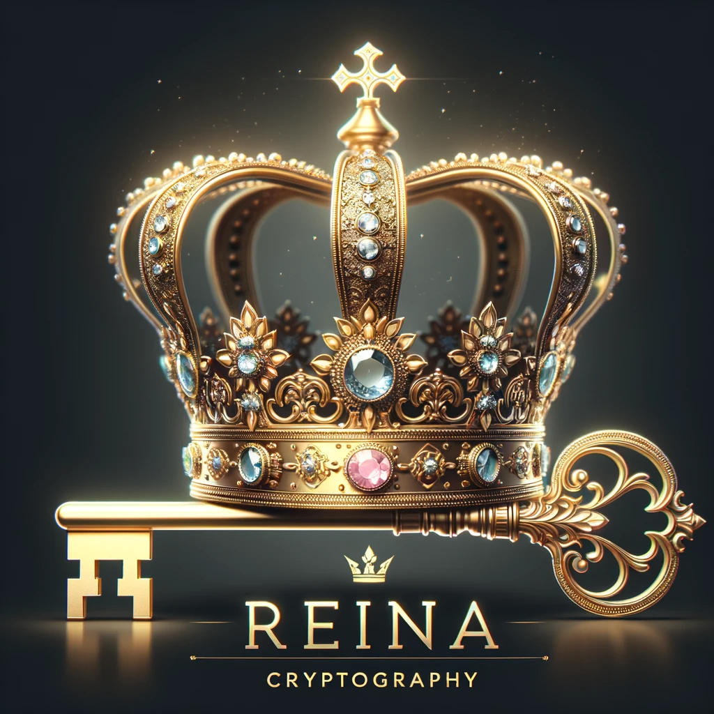

[](https://opensource.org/license/mit/) &nbsp; [](https://github.com/fkitsantas/Reina.Cryptography/actions/workflows/build-and-release.yml) &nbsp; [](https://github.com/fkitsantas/Reina.Cryptography/actions/workflows/generate-and-deploy-documentation.yml)

## Project Overview
Reina Cryptography is a state-of-the-art class library for .NET and .NET Framework, offering cascading triple-layered encryption/decryption (Twofish->Serpent->AES), with internal key management and unique IVs for each layer, each prepended to its respective cipher for enhanced data security. The library integrates with Azure Key Vault for seamless store/retrieve of the 256-bit encryption key(s).

## Table of Contents
1. [**Introduction**](#introduction)
   - [Core Features and Capabilities](#core-features-and-capabilities)
   - [Target Audience and Application Scenarios](#target-audience-and-application-scenarios)
2. [**Requirements and Dependencies**](#system-requirements-and-dependencies)
   - [Software Requirements](#software-requirements)
   - [External Dependencies](#external-dependencies)
3. [**Detailed Usage Guide**](#detailed-usage-guide)
   - 3.1 [Functionality Overview](#functionality-overview)
      - [Encryption Process Explained](#encryption-process-explained)
      - [Decryption Process Explained](#decryption-process-explained)
   - 3.2 [Integration with Azure Key Vault](#integration-with-azure-key-vault)
   - 3.3 [API Reference](#api-reference)
      - [`Configuration` Method: Detailed Description and Parameters](#configuration-method-detailed-description-and-parameters)
      - [`Encrypt` Method: Detailed Description and Parameters](#encrypt-method-detailed-description-and-parameters)
      - [`Decrypt` Method: Detailed Description and Parameters](#decrypt-method-detailed-description-and-parameters)
   - 3.4 [Integration and Usage of Reina.Cryptography Library](#integration-and-usage-of-reinacryptography-library)
4. [**Project Design**](#project-design)
   - 4.1 [Architecture Overview](#architecture-overview)
   - 4.2 [Library Structure](#library-structure)
   - 4.3 [Streamlined CI/CD with GitHub Actions](#streamlined-cicd-with-github-actions)
      - [Dependabot](#dependabot)
      - [Build and Release](#build-and-release)
      - [Generate and Deploy Documentation](#generate-and-deploy-documentation)
5. [**Security Considerations**](#security-considerations)
   - [Security Enhancement with a .NET Obfuscator](#security-enhancement-with-a-net-obfuscator)
6. [**Troubleshooting and Support**](#troubleshooting-and-support)
   - [Common Issues and Resolutions](#common-issues-and-resolutions)
   - [Getting Help and Support Resources](#getting-help-and-support-resources)
7. [**Contributing to Reina.Cryptography**](#contributing-to-reina-cryptography)
   - [Contribution Guidelines](#contribution-guidelines)
   - [Community and Development Process](#community-and-development-process)
8. [**License and Legal Information**](#license-and-legal-information)
   - [Licensing Details](#licensing-details)
   - [Acknowledgments and Third-Party Licenses](#acknowledgments-and-third-party-licenses)
9. [**About Reina.Cryptography**](#about-reinacryptography)
   - [Author](#author)
---

## Introduction

Reina Cryptography is designed to integrate effortlessly with Azure Key Vault, providing a robust and secure management system for 256-bit encryption keys, enabling developers to perform extremely complex encryption and decryption tasks with ease.

### Core Features and Capabilities

 The core features that define the essence of this library:
- **Triple-Layered Cascading Encryption Technique**: At the heart of Reina Cryptography is the Cascading Encryption Technique, which empowers developers to layer encryption through a sequence of Twofish, Serpent, and AES algorithms. This methodical layering is more than just a security feature; it's a commitment to data integrity and confidentiality. Even in the event of a breach in one encryption layer, the remaining layers maintain their defensive posture, safeguarding the encrypted data.

- **Seamless Azure Key Vault Integration**: The library integrates flawlessly with Azure Key Vault, ensuring secure and efficient management of 256-bit encryption keys. This integration guarantees that cryptographic keys are not only safeguarded but also readily available for encryption tasks. The developer doesn't have to worry about storing/retrieving these keys as the Library handles that during encryption and decryption automatically.
  
- **Flexible Key Management Options**: The library provides the flexibility to generate and utilize distinct 256-bit keys for each encryption algorithm or to employ a single key across multiple algorithms. This flexibility allows developers to choose the level of granularity in security that best suits their application's needs. By leveraging Azure Key Vault, Reina Cryptography ensures that these cryptographic keys are safely stored on the cloud, rather than being hardcoded, thereby enhancing security and reducing the potential for key compromise.
  
- **Unique Initialization Vector (IV) for Each Operation**: Each encryption operation within the library is complemented by a securely generated, unique Initialization Vector (IV). These IVs are not merely appended but are intricately woven into the ciphertext, bolstering the encryption against pattern analysis and brute-force attacks. This strategic approach to encryption ensures that each piece of data remains an enigma, challenging even the most advanced decryption attempts.

Building on these core features, Reina Cryptography offers a comprehensive solution for developers seeking a robust and versatile encryption toolkit.
<a href="#table-of-contents" title="Back to Top"></a>

### Target Audience and Application Scenarios

Reina Cryptography is designed to cater to a diverse range of users and application scenarios, making it a versatile tool in the realm of encryption and security.

#### Target Audiences:
- **Software Development Companies**: Ideal for companies looking to enhance the security of their applications, Reina Cryptography can be integrated into their development process. Companies can hardcode their Azure Key Vault credentials in the `Config.cs` file, obfuscate the produced .dll, and distribute it to their development teams. This approach allows developers to leverage the company's Azure Key Vault for encryption and decryption tasks without direct access to the sensitive credentials, ensuring a secure and centralized key management system.

- **Individual Developers**: The library is also well-suited for individual developers working on .NET or .NET Framework applications who require robust encryption capabilities. Whether for personal projects or professional development, Reina Cryptography offers an easy way to integrate Azure Key Vault and implement advanced encryption techniques.

- **Enterprise Security Solutions**: Enterprises seeking to bolster their data security can utilize Reina Cryptography to protect sensitive information. The library's advanced encryption methods are ideal for securing data in transit and at rest, making it a valuable tool for enterprise security strategies.

#### Application Scenarios:
- **Cloud-Based Applications**: For applications deployed in cloud environments, Reina Cryptography provides an additional layer of security. Its integration with Azure Key Vault makes it particularly suitable for applications hosted on Azure, ensuring that encryption keys are managed securely in the cloud.

- **Financial Technology (FinTech) Applications**: In the FinTech sector, where data security is paramount, Reina Cryptography can be used to secure financial transactions and sensitive customer data. Its robust encryption capabilities ensure that financial data remains confidential and secure.

- **Healthcare Applications**: Healthcare applications dealing with sensitive patient data can benefit from the high level of security offered by Reina Cryptography. The library ensures that patient information is encrypted and stored securely, complying with regulatory standards like HIPAA.

- **E-Commerce Platforms**: E-commerce sites handling customer data and transactions can use Reina Cryptography to secure customer information, payment details, and transaction records, providing customers with confidence in the platform's security measures.

- **Government and Public Sector**: Ideal for government agencies requiring secure data storage, especially in handling sensitive citizen data.

In summary, Reina Cryptography is a versatile library that can be employed in various scenarios where data security is crucial. Its ease of integration with Azure Key Vault and its advanced encryption capabilities make it an ideal choice for a wide range of applications, from individual developer projects to large-scale enterprise solutions.
<a href="#table-of-contents" title="Back to Top"></a>

## Requirements and Dependencies

### Software Requirements

The library is designed for use with the .NET Framework and .NET platforms.

- **.NET Framework 4.8.1**: The latest major release of Microsoft's .NET Framework. [Download .NET Framework 4.8.1](https://dotnet.microsoft.com/en-us/download/dotnet-framework/net481)

- **.NET 7**: The latest major release of Microsoft's .NET. [Download .NET 7](https://dotnet.microsoft.com/en-us/download/dotnet/7.0)
<a href="#table-of-contents" title="Back to Top"></a>

### External Dependencies

Reina Cryptography integrates with external libraries to provide its advanced features. The following dependencies are used internally for the library's functionality:
- **Azure SDK Packages**:
  - `Azure.Core`: Provides shared components for Azure client libraries.
  - `Azure.Identity`: Enables Azure Active Directory token authentication.
  - `Azure.Security.KeyVault.Keys`: Manages keys and related cryptographic operations in Azure Key Vault.
  - `Azure.Security.KeyVault.Secrets`: Handles secrets and secure storage in Azure Key Vault.
- **BouncyCastle Cryptography**: A comprehensive cryptography library providing a range of encryption algorithms.
- **Fody** and **Costura.Fody**: Used for embedding dependencies into the library assembly, ensuring a single, self-contained DLL.
<a href="#table-of-contents" title="Back to Top"></a>

## Detailed Usage Guide

### Functionality Overview

#### Encryption Process Explained

1. **Calling the Encrypt Method:**
   - The process starts when the `Encrypt` method in `Library.cs` is called. This method serves as the gateway to initiate the encryption process.

2. **Key Retrieval Process:**
   - The method interacts with `
   - 
   - .cs` to retrieve the necessary encryption keys.
   - Depending on user input, either a single key or three different keys are fetched. If one key name is provided, the same key is used across all encryption layers. If three key names are provided, each key is used for a specific algorithm – the first for Twofish, the second for Serpent, and the third for AES.

3. **Encryption in Layers with Unique IVs:**
   - The encryption is performed in three layers, each with a unique Initialization Vector (IV).
   - **First Layer - Twofish:**
     - A new IV is generated for the Twofish encryption.
     - The data is encrypted using Twofish with its corresponding key and IV.
     - The IV is then prepended to the Twofish encrypted data.
   - **Second Layer - Serpent:**
     - Another new IV is generated for the Serpent encryption.
     - The Twofish encrypted data (including its IV) is encrypted using Serpent with its respective key and this new IV.
     - This IV is then prepended to the Serpent encrypted data.
   - **Third Layer - AES:**
     - A final new IV is generated for the AES encryption.
     - The Serpent encrypted data (with its IV) is encrypted using AES with its key and this new IV.
     - This IV is then prepended to the AES encrypted data.

4. **Output:**
   - The final output is a securely encrypted data block, which consists of the AES encrypted data and its IV, containing within it the Serpent encrypted data and its IV, and within that, the Twofish encrypted data and its IV. This multi-layered approach with unique IVs for each layer ensures a high level of security.
<a href="#table-of-contents" title="Back to Top"></a>

#### Decryption Process Explained

1. **Calling the Decrypt Method:**
   - The decryption process begins with the `Decrypt` method in `Library.cs`. This method is responsible for reversing the encryption process.

2. **Key Retrieval Process:**
   - Similar to encryption, the `Decrypt` method retrieves keys from `AzureKeyManager.cs`.
   - If one key name was used for encryption, the same key is fetched for all decryption layers. If three different key names were used, each corresponding key is fetched for its specific decryption algorithm.

3. **Layered Decryption with Unique IVs:**
   - The decryption process mirrors the encryption layers, but in reverse order, each with its respective IV.
   - **First Layer - AES:**
     - The method extracts the IV prepended to the encrypted data.
     - The data is decrypted using AES with its key and the extracted IV.
     - The remaining data (still encrypted with Serpent) is separated from the AES IV.
   - **Second Layer - Serpent:**
     - The next IV (for Serpent) is extracted from the remaining data.
     - The data is then decrypted using Serpent with its key and the extracted IV.
     - The remaining data (still encrypted with Twofish) is separated from the Serpent IV.
   - **Third Layer - Twofish:**
     - The final IV (for Twofish) is extracted from the remaining data.
     - The data is decrypted using Twofish with its key and the extracted IV, resulting in the original plaintext.

4. **Output:**
   - The output is the original unencrypted data, successfully decrypted and restored to its initial form.
<a href="#table-of-contents" title="Back to Top"></a>

### Integration with Azure Key Vault

The `Config.cs` file, located in the Configuration folder, is handling the Azure Key Vault credentials. These variables need to be populated to ensure seamless authentication:

- `AzureKeyVaultUrl`: URL for the Azure Key Vault.
- `AzureClientId`: Client ID for Azure authentication.
- `AzureClientSecret`: Client secret for Azure authentication.
- `AzureTenantId`: Tenant ID for Azure authentication.

**Critical Notice:**
- If the Azure Key Vault credentials are not hardcoded in the `Config.cs` file to be as default configuration values when you produce the Reina.Cryptography.dll, it is imperative for the developer who references the produced Reina.Cryptography.dll on his project to use the manual configuration option. This involves invoking the `Configuration` method within the library to explicitly set the Azure Key Vault credentials as required.
<a href="#table-of-contents" title="Back to Top"></a>

### API Reference

#### `Configuration` Method: Detailed Description and Parameters

The `Configuration` method is designed to configure the library with custom Azure Key Vault settings. This method must be invoked to set up the necessary parameters for Azure Key Vault before performing encryption or decryption operations. If not called, the library uses default configuration values.

- **Parameters:**
  - `azureKeyVaultUrl` (string): The URL of the Azure Key Vault.
  - `azureClientId` (string): The Azure client ID used for authentication.
  - `azureClientSecret` (string): The Azure client secret for authentication.
  - `azureTenantId` (string): The Azure tenant ID for authentication.

<a href="#table-of-contents" title="Back to Top"></a>

#### `Encrypt` Method: Detailed Description and Parameters

The `Encrypt` method offers flexible encryption capabilities, allowing users to encrypt plaintext strings using either a single key or separate keys for each encryption algorithm. This method supports two overloads:

1. **Three-Key Encryption:**
   - This overload is designed for enhanced security, employing three distinct cryptographic algorithms—Twofish, Serpent, and AES—each using a separate key.
   - **Parameters:**
     - `decryptedString` (string): The plaintext string to be encrypted.
     - `twofishKeyName` (string): The name of the Twofish key.
     - `serpentKeyName` (string): The name of the Serpent key.
     - `aesKeyName` (string): The name of the AES key.
   - **Returns:** A Base64-encoded string representing the encrypted data.
   - **Exceptions:**
     - `ArgumentNullException`: Thrown if the input string or any of the key names is null or empty.
     - `ArgumentException`: Thrown if any of the key names do not adhere to the expected format.

2. **Single-Key Encryption:**
   - This overload provides a simpler approach, using a single key name for all three encryption algorithms. It internally calls the three-key overload with the same key name for all three parameters.
   - **Parameters:**
     - `decryptedString` (string): The plaintext string to be encrypted.
     - `keyName` (string): The name of the key to be used for all three encryption algorithms.
   - **Returns:** A Base64-encoded string representing the encrypted data.
   - **Exceptions:**
     - `ArgumentNullException`: Thrown if the input string or the key name is null or empty.
     - `ArgumentException`: Thrown if the key name does not adhere to the expected format.

Both overloads of the `Encrypt` method are designed to securely interface with Azure Key Vault for key retrieval, ensuring the secure management and storage of cryptographic keys. The choice between using a single key or multiple keys allows for flexibility in balancing security needs and operational simplicity.

<a href="#table-of-contents" title="Back to Top"></a>

#### `Decrypt` Method: Detailed Description and Parameters

The `Decrypt` method reverts the encryption process and retrieves the original plaintext from encrypted data. Like the `Encrypt` method, it supports two overloads for flexible decryption using either a single key or separate keys for each decryption algorithm.

1. **Three-Key Decryption:**
   - This overload is tailored for scenarios where data was encrypted using three distinct keys for Twofish, Serpent, and AES algorithms. It is essential for maintaining the integrity of the decryption process that the same keys used for encryption are applied here.
   - **Parameters:**
     - `encryptedString` (string): The Base64-encoded string to be decrypted.
     - `twofishKeyName` (string): The name of the Twofish key.
     - `serpentKeyName` (string): The name of the Serpent key.
     - `aesKeyName` (string): The name of the AES key.
   - **Returns:** The decrypted plaintext string.
   - **Exceptions:**
     - `ArgumentNullException`: Thrown if the encrypted string or any of the key names is null or empty.
     - `ArgumentException`: Thrown if any of the key names do not adhere to the expected format.

2. **Single-Key Decryption:**
   - This simpler overload is useful when the same key name is used for all three decryption algorithms. It internally calls the three-key overload with the same key name for all three parameters.
   - **Parameters:**
     - `encryptedString` (string): The Base64-encoded string to be decrypted.
     - `keyName` (string): The name of the key to be used for all three decryption algorithms.
   - **Returns:** The decrypted plaintext string.
   - **Exceptions:**
     - `ArgumentNullException`: Thrown if the encrypted string or the key name is null or empty.
     - `ArgumentException`: Thrown if the key name does not adhere to the expected format.

Both overloads of the `Decrypt` method ensure secure interaction with Azure Key Vault for key retrieval, mirroring the encryption process but in reverse. This design choice offers users the flexibility to choose between single-key and multiple-key decryption based on their security requirements and the encryption approach originally used.

<a href="#table-of-contents" title="Back to Top"></a>

#### Integration and Usage of Reina.Cryptography Library

Integrating and using the Reina.Cryptography library in your project is a straightforward process. Here’s how you can seamlessly incorporate and utilize this library:

##### Referencing the Library
Firstly, ensure that the `Reina.Cryptography.dll` is referenced in your project.

##### Using the Library in Your Code
After referencing the DLL, you can use the library's functionalities in any .cs file within your project. Follow these steps:

1. **Add a Namespace Reference:**
   - At the top of your .cs file, include a using directive for the `Reina.Cryptography.Library`. This enables you to access the library's methods easily.
   - Example:
     ```csharp
     using ReinaCryptography = Reina.Cryptography.Library;
     ```

2. **Calling Encrypt and Decrypt Methods:**
   - You can directly call the `Encrypt` or `Decrypt` methods in your code. These methods are available for different use cases, as shown below:
     - Encrypting with a single key name:
       ```csharp
       string encryptedText = ReinaCryptography.Encrypt("YourStringHere", "KeyName");
       ```
     - Encrypting with three key names (for Twofish, Serpent, and AES):
       ```csharp
       string encryptedText = ReinaCryptography.Encrypt("YourStringHere", "TwofishKeyName", "SerpentKeyName", "AESKeyName");
       ```
     - Similarly, use the `Decrypt` method for decryption:
       ```csharp
       string decryptedText = ReinaCryptography.Decrypt("YourEncryptedString", "KeyName");
       // Or
       string decryptedText = ReinaCryptography.Decrypt("YourEncryptedString", "TwofishKeyName", "SerpentKeyName", "AESKeyName");
       ```

##### Key Management in Azure Key Vault
- When using a single key name with the `Encrypt` method, the library interacts with Azure Key Vault to retrieve the corresponding 256-bit key. If the key does not exist, it will automatically create a 256-bit key in Azure Key Vault under the provided name. This key is then used for the cascading encryption process (Twofish, Serpent, AES) with unique IVs for each stage.
- If three key names are provided, the library follows a similar procedure but retrieves or creates separate 256-bit keys for each encryption algorithm. This approach ensures that each encryption stage (Twofish, Serpent, AES) uses a distinct key, enhancing the security of the encryption process.
<a href="#table-of-contents" title="Back to Top"></a>

## Project Design

Reina.Cryptography is engineered with a focus on modularity, scalability, maintainability, and robust security. The library's design employs a layered architecture, strategically crafted to achieve these objectives.
### Architecture Overview

The architecture is composed of several key components, each designed to fulfill specific roles within the library:

1. **Interface Layer**: This layer serves as a contract for each module, promoting separation of concerns and enabling a flexible, plug-and-play methodology. It ensures that different components can interact seamlessly while maintaining clear boundaries.

2. **Implementation Layer**: Here, concrete implementations of the defined interfaces are provided. This layer forms the backbone of the library, offering the primary functionalities. Its design allows for the extension or replacement of modules without impacting other system parts, exemplifying the principle of modularity.

3. **Integration with Azure Key Vault**: A critical aspect of the library is its integration with Azure Key Vault for secure encryption key management. This integration is crucial for maintaining high security and reliability in cryptographic operations.

4. **Exception Handling**: The library includes robust exception handling mechanisms. These are designed to provide clear and informative feedback on issues related to configuration, encryption, or key management, aiding developers in effective troubleshooting.

<a href="#table-of-contents" title="Back to Top"></a>

### Library Structure

The library is organized into the following modules:

- **Configuration Module**: Contains the `Config` class, which manages the configuration settings for accessing Azure Key Vault.

- **Decryption Module**: Contains the `DataDecryptor` class, which is responsible for decrypting data.

- **Encryption Module**: Contains the `DataEncryptor` class, which is responsible for encrypting data.
  
- **Interfaces Module**: Defines the interfaces for configuration, encryption, decryption, and key management.

- **Key Management Module**: Contains the `AzureKeyManager` class, which integrates with Azure Key Vault for key management.

Each module in Reina.Cryptography is designed to work independently yet cohesively, contributing to the library's overall effectiveness and efficiency. This structured approach not only simplifies maintenance and upgrades but also enhances the library's usability across various application scenarios.
<a href="#table-of-contents" title="Back to Top"></a>

### Streamlined CI/CD with GitHub Actions

Continuous Integration and Continuous Deployment (CI/CD) are fundamental practices in modern software development, aimed at enhancing code quality and streamlining the release process. Reina Cryptography leverages GitHub Actions to automate the CI/CD pipeline. This automation ensures that every code push is built, tested (ToDo), and released automatically. Additionally, the documentation is dynamically generated and deployed, keeping the project's documentation up-to-date with the latest changes. Below are the badges representing the status of the CI/CD pipelines:

- **Build and Release**: This badge reflects the current status of the build and release pipeline, ensuring that every change in the main branch is automatically built and ready for release.  
  [](https://github.com/fkitsantas/Reina.Cryptography/actions/workflows/build-and-release.yml)

- **Generate and Deploy Documentation**: This badge indicates the status of the documentation generation and deployment process. It ensures that the documentation is always synchronized with the latest version of the code.  
  [](https://github.com/fkitsantas/Reina.Cryptography/actions/workflows/generate-and-deploy-documentation.yml)


#### Dependabot

Reina Cryptography leverages GitHub's Dependabot to ensure all dependencies are up-to-date. Dependabot checks daily for updates in project dependencies and automatically creates pull requests to update the `PackageReference` versions in the project file. This proactive approach ensures that the library is always using the latest, most secure versions of its dependencies, reducing the risk of vulnerabilities.
<a href="#table-of-contents" title="Back to Top"></a>

#### Build and Release

The ["Build and Release" workflow](https://github.com/fkitsantas/Reina.Cryptography/blob/main/.github/workflows/build-and-release.yml) in GitHub Actions is a crucial part of Reina Cryptography's CI/CD pipeline. This workflow is triggered on every push to the main branch, excluding changes to workflow files, resources, and the README.md file. The steps involved in this workflow are:

1. **Check out code**: The latest version of the codebase is checked out for building and releasing.

2. **Get the last commit message**: This step captures the last commit message for use in the release notes.

3. **Calculate version number**: The workflow calculates a new version number based on the number of commits. This ensures a unique version for each build, facilitating traceability and version management.

4. **Update project version**: The calculated version number is then used to update the project file (`Reina.Cryptography.csproj`).

5. **Build Project**: The project is built for both .NET Framework 4.8.1 and .NET 7, ensuring compatibility across different environments.

6. **Create Release**: A new GitHub release is created with the calculated version number, including the last commit message as the release note.

7. **Upload .dll files**: The built DLL files for both .NET Framework 4.8.1 and .NET 7 are uploaded as assets to the GitHub release, making them available for download.

This workflow automates the process of building, versioning, and releasing the library, ensuring a consistent and reliable delivery process.

<a href="#table-of-contents" title="Back to Top"></a>

#### Generate and Deploy Documentation

The ["Generate and Deploy Documentation" workflow](https://github.com/fkitsantas/Reina.Cryptography/blob/main/.github/workflows/generate-and-deploy-documentation.yml) is another integral part of the CI/CD pipeline. This workflow is responsible for automatically generating and deploying the project's documentation. The steps include:

1. **Checkout Repository**: The latest version of the repository is checked out.

2. **Install Doxygen**: Doxygen, a documentation generation tool, is installed on the runner.

3. **Generate Documentation**: Doxygen reads the configured `Doxyfile` and generates documentation from the codebase.

4. **Deploy to GitHub Pages**: The generated documentation is then deployed to GitHub Pages, making it accessible to users and contributors. This ensures that the project's documentation is always up-to-date with the latest code changes.

This workflow simplifies the process of maintaining up-to-date and accessible documentation, which is crucial for both users and contributors to understand and effectively use the library.
<a href="#table-of-contents" title="Back to Top"></a>

## Security Considerations

### Security Enhancement with a .NET Obfuscator

For an added layer of security, especially when handling sensitive information like Azure Key Vault credentials in your DLL, it is highly recommended to use a .NET Obfuscator. In this context, .NET Reactor emerges as a top choice. It offers advanced protection against reverse engineering, vital to prevent unauthorized access to your Azure Key Vault credentials and the keys it safeguards.
<a href="#table-of-contents" title="Back to Top"></a>

## Troubleshooting and Support

### Common Issues and Resolutions

While the library is designed with comprehensive error handling to provide clear and informative exception messages, common issues that could happen:

#### 1. Invalid Azure Key Vault Credentials
- **Issue:** Failure in encryption or decryption due to incorrect Azure credentials.
- **Resolution:** Verify that the Azure Key Vault URL, Client ID, Client Secret, and Tenant ID are correctly set in the `Config.cs` file. If you're using manual configuration, ensure that the `Configuration` method is invoked with accurate parameters.

#### 2. Missing or Incorrect Encryption/Decryption Keys
- **Issue:** Exceptions thrown due to missing or incorrect key names provided for encryption or decryption.
- **Resolution:** Check the key names provided in the `Encrypt` or `Decrypt` method calls. Ensure they match the keys stored in Azure Key Vault and that they are correctly passed to the methods.

#### 3. Network or Connectivity Issues
- **Issue:** Unable to connect to Azure Key Vault, possibly due to network issues.
- **Resolution:** Verify network connectivity and ensure that the Azure Key Vault service is reachable. Check firewall and proxy settings if necessary.
<a href="#table-of-contents" title="Back to Top"></a>

### Getting Help and Support Resources

If you encounter any issues or have questions regarding Reina.Cryptography, please feel free to seek assistance through the Issues page.

To open an issue, please visit: [Reina.Cryptography Issues](https://github.com/fkitsantas/Reina.Cryptography/issues).
<a href="#table-of-contents" title="Back to Top"></a>

## Contributing to Reina.Cryptography

### Contribution Guidelines

Contributions to the project are warmly welcomed. If you're interested in contributing, here are some guidelines to help you get started:

1. **Fork the Repository**: Begin by forking the [Reina.Cryptography repository](https://github.com/fkitsantas/Reina.Cryptography) on GitHub.

2. **Create a Branch**: For each new feature or bug fix, create a new branch in your forked repository. This helps keep changes organized.

3. **Code Conventions**: Please follow the existing coding style and conventions. This includes proper documentation for any new code and adhering to the established architectural patterns.

4. **Testing**: Ensure that your code is thoroughly tested. Quality and reliability are paramount, and comprehensive tests help maintain these standards.

5. **Pull Requests**: Once your changes are ready, submit a pull request with a clear description of the changes and any relevant issue numbers.

6. **Code Review**: I will review your pull request. Be open to feedback and ready to make revisions if necessary.

7. **Merging**: After approval, your changes will be merged into the main branch.

Your contributions are crucial in the continuous development and improvement of Reina.Cryptography. I appreciate your efforts in making this project better for everyone.
<a href="#table-of-contents" title="Back to Top"></a>

### Community and Development Process

The development of Reina.Cryptography is currently a solo endeavor, but I am hopeful that it will grow into a community-driven project. Here's how you can be part of this journey:

- **Stay Updated**: Follow the project on GitHub to stay updated with the latest developments.
- **Join Discussions**: Participate in discussions on GitHub issues and pull requests. Your insights and feedback are valuable.
- **Share Your Experiences**: If you've integrated Reina.Cryptography in your project(s), consider sharing your experiences. This helps others learn and grow.
- **Report Issues**: If you find bugs or have suggestions for improvements, please report them through GitHub issues.

Your engagement and contributions are what will shape the future of Reina.Cryptography. Together, we can build a robust, secure, and user-friendly cryptography library.
<a href="#table-of-contents" title="Back to Top"></a>

## License and Legal Information

### Licensing Details

Reina.Cryptography is available under the MIT License, a permissive free software license. This means you are free to use, modify, distribute, and even use the library commercially, as long as you include the original copyright and license notice in any copy of the software or substantial portions of it. The full details of the MIT License can be viewed on the project's [License](LICENSE).
<a href="#table-of-contents" title="Back to Top"></a>

### Acknowledgments and Third-Party Licenses

Reina.Cryptography extends its gratitude to the Legion of the Bouncy Castle for their foundational cryptographic library. Their work has been instrumental in the development of this project. For more information about their contributions to the field of cryptography, please visit their [official website](https://www.bouncycastle.org).

In addition, thanks to [Fody](https://github.com/Fody/Fody) and [Fody.Costura](https://github.com/Fody/Costura) for the ability to embed dependencies directly into the produced DLL of a Class Library. This functionality has greatly streamlined the end-user experience by simplifying the management of dependencies.

Special acknowledgment goes to Tom Englert ([@tom-englert](https://github.com/tom-englert)) for his guidance in configuring Fody.Costura for multi-target support in this project.
<a href="#table-of-contents" title="Back to Top"></a>

## About Reina.Cryptography



*"I married a Software Engineer, who codes all day but hasn't created an app with my name"* said my wife, Reina, half-jokingly. So, here we are..

Reina.Cryptography, a top-notch Class Library for .NET & .NET Framework, dedicated to my drop-dead gorgeous and out-of-this-world amazing wife, Reina. ❤️

### Author

**Fotios Kitsantas** ([fkitsantas@icloud.com](mailto:fkitsantas@icloud.com))  
Senior Software Engineer  
📍 London, United Kingdom

For inquiries or feedback, please contact via the provided email.  
<a href="#table-of-contents" title="Back to Top"></a>
